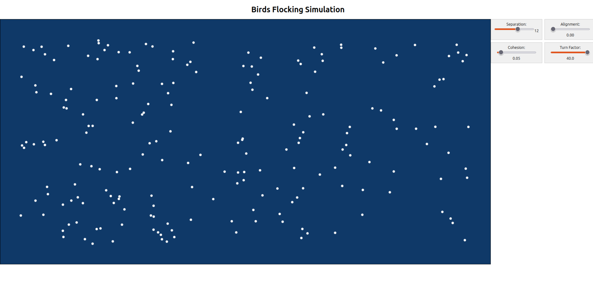

# Boids Simulation

This project simulates birds flocking using the Boids algorithm. This algorithm employs four simple rules to create seemingly complex behavior: separation, alignment, cohesion, and turn factor. As a bonus, the mouse also acts as a food source when inside the canvas, attracting nearby birds toward it.

### Separation

Separation repels two birds from each other if they're too close. This ensures that the birds maintain a safe distance between each other to avoid collisions.

### Alignment

Alignment causes each bird to adjust its direction slightly to match the direction of its neighboring birds. This allows nearby birds to travel in the same general direction.

### Cohesion

Cohesion moves each bird toward the average position of nearby birds. This encourages birds to travel in flocks and stay together, rather than each traveling in different random positions.

### Turn Factor

The turn factor determines how sharply a bird is repelled from traveling into a wall of the canvas. The higher the factor, the sharper the change in direction. This allows birds to smoothly steer away from walls.

The weight of each of these factors can be adjusted by the scales on the right hand side. 

## How To Run

In the project directory, you can run with:

### `npm start`

Runs the app in the development mode.\
Open [http://localhost:3000](http://localhost:3000) to view it in your browser.

The page will reload when you make changes.\
You may also see any lint errors in the console.
